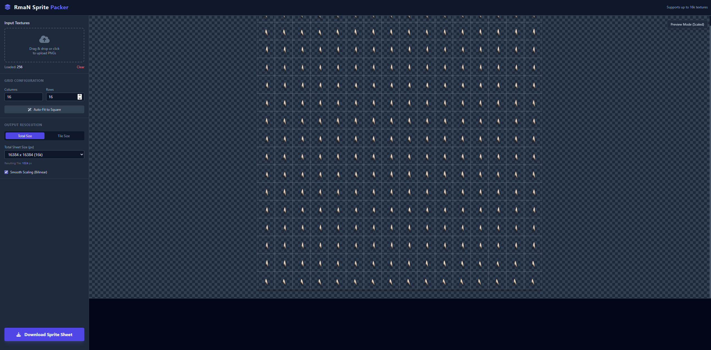

# Moses Sprite Packer

A browser-based HTML5 spritesheet packer with live preview. Drop in multiple PNG/JPEG/WebP images, arrange them on a grid, and export a high-resolution spritesheet (up to 16k) without any server side code.

## Features
- Drag-and-drop or file picker for loading multiple textures
- Auto-fit grid calculation plus manual row/column controls
- Two sizing modes: fixed total sheet size or fixed tile size
- Smooth (bilinear) or crisp scaling toggle for previews/exports
- Live checkerboard preview with grid overlay before downloading
- Exports PNG spritesheets with filenames that include output dimensions

## Getting Started
1. Open `index.html` in any modern desktop browser (Chrome/Firefox/Edge). No build steps required.
2. Drag and drop your images onto the input area or use the file picker.
3. Adjust grid (rows/cols) and sizing mode:
   - **Total Size**: choose overall sheet size; tile size is derived from columns/rows.
   - **Tile Size**: set per-cell size; sheet size is derived.
4. Toggle **Smooth Scaling** if you prefer bilinear filtering; turn it off for pixel-art sharpness.
5. Click **Download Sprite Sheet** to export a PNG. The filename encodes the final resolution.

## Tips
- Use **Auto-Fit to Square** after your first batch of images to quickly set a near-square grid.
- Keep an eye on the preview grid lines to ensure tiles fit as expected; rows/cols beyond your image count are ignored during drawing.
- Very large sheets (8k–16k) can be memory-heavy in browsers; start with smaller sizes if you encounter issues.

## Development
This is a single-page app with no build tooling. If you want local hosting instead of opening the file directly, you can run a static server (e.g., `npx serve .`) and open `http://localhost:3000`.
